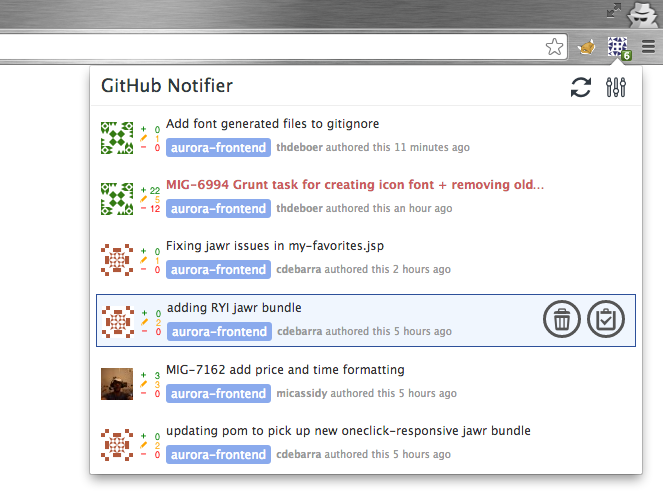

# github-notifier

GitHub Notifier is a browser extension able to receive notifications from a GitHub Listener. Its purpose is to make code reviews easier, by notifying people every time they are @mentioned in a commit message, and providing one-click access to the commit diff.
Currently, only commit notifications are supported.

Every notification in the popup shows (from left to right):

- the author's avatar image;
- three numeric indicators, reflecting the number of files added, modified or deleted in that commit;
- the commit message (highlighted in red if the user was explicitly @mentioned);
- the repository to which this commit was pushed;
- the author and relative time of the commit.

For every commit, it is possible to dismiss the notification (by clicking on the trashcan icon), to click on it in order to see the diff (this would open the GitHub commit page), click the repository name to go the repository home page, and mark the notification as Reviewed (by clicking on the notepad icon).

The Options panel allows to configure the current user's GitHub username, the URL to the GitHub Listener instance which will provide notifications about commits, and then any number of usernames which the user wants to "follow" - adding them allows to receive notifications every time they push a commit, even if the user was not explicitly @mentioned in its message.

